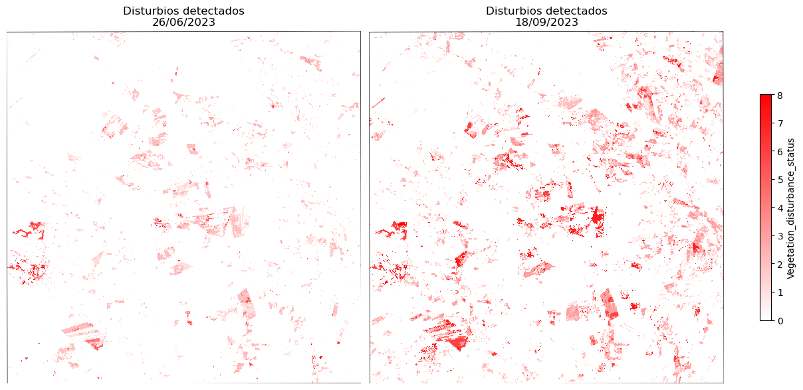
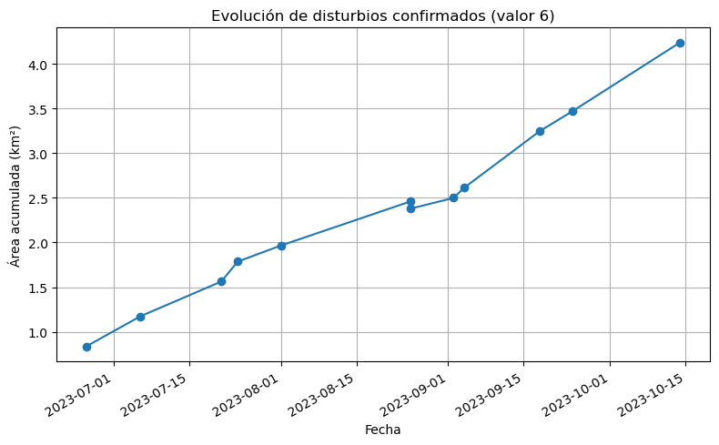
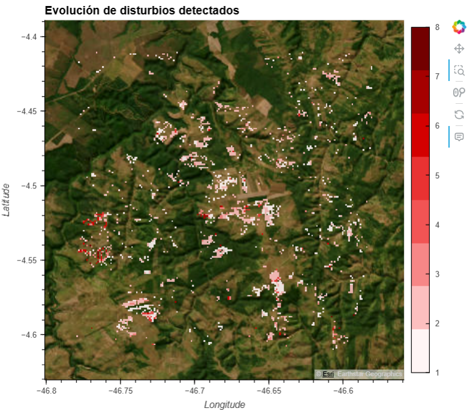
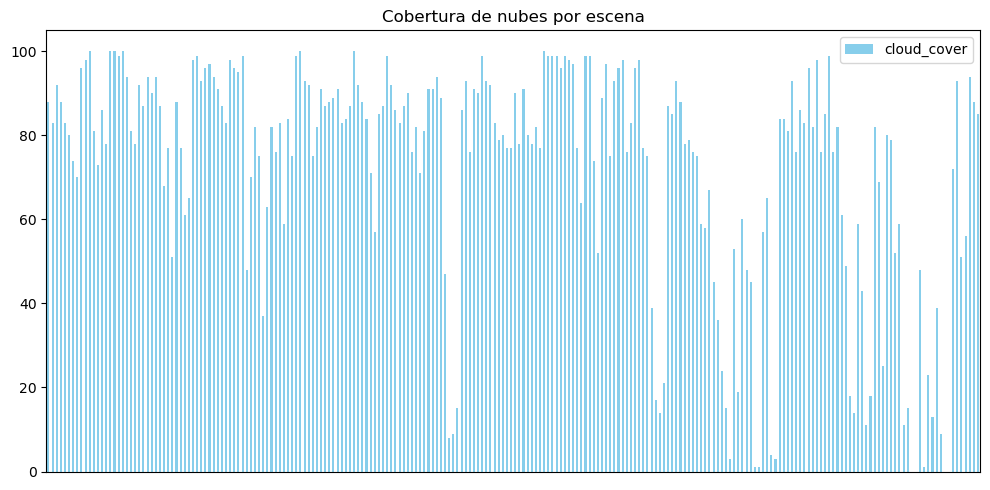
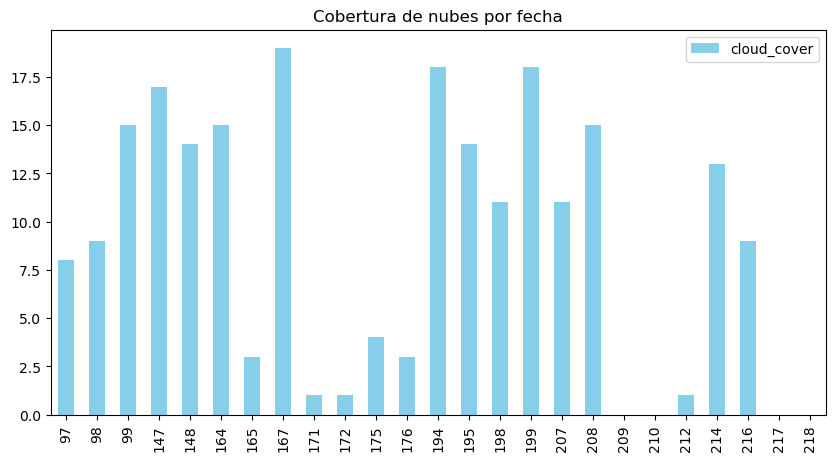
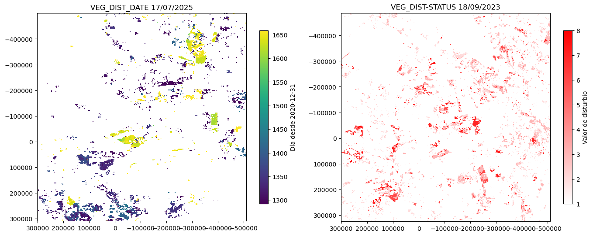

:::::::::::::::::::::::::::::::::::::: questions 

- ¿Qué proporción del área de estudio presenta disturbios recientes en la cobertura vegetal según los datos VEG_DIST_STATUS filtrados por baja nubosidad?
- ¿Cómo ha evolucionado la extensión de los disturbios a lo largo del período analizado en Buriticupu?
- ¿En qué zonas y fechas específicas se detectaron los disturbios más intensos (≥50% de cambio en la cobertura vegetal)?

::::::::::::::::::::::::::::::::::::::::::::::::

::::::::::::::::::::::::::::::::::::: objectives

- Procesar y filtrar los productos OPERA DIST-ALERT para extraer información relevante del área de estudio en Maranhão.
- Visualizar y analizar los cambios en la cobertura vegetal a lo largo del tiempo, identificando patrones de disturbio recientes.
- Elaborar mapas y gráficos que sinteticen la información geoespacial, facilitando la interpretación y comunicación de los resultados para la toma de decisiones en conservación.


  
::::::::::::::::::::::::::::::::::::::::::::::::


# Deforestación en Maranhão

La Amazonía es una de las regiones más biodiversas del planeta y un componente clave del sistema climático global que además sostiene múltiples comunidades indígenas. En particular el estado de Maranhão, en Brasil, es uno de los focos más críticos de deforestación en el país. Se estima que el 76 % de la cobertura original de bosque amazónico en este estado ha sido destruida. Según Global Forest Watch, Maranhão ha registrado una de las tasas más altas de pérdida de cobertura boscosa en Brasil en los últimos años, impulsada por incendios, expansión agropecuaria y tala ilegal. Estos procesos están estrechamente ligados a la fragmentación ecológica, la pérdida de biodiversidad y la violencia hacia comunidades indígenas. Frente a este escenario, el monitoreo sistemático de los cambios en la cobertura vegetal es fundamental. Los productos OPERA DIST-HLS, derivados principalmente de Landsat (NASA/USGS) y Sentinel-2 (ESA), ofrecen una herramienta poderosa para detectar disturbios recientes y aportar evidencia clave para la conservación y la formulación de políticas públicas basadas en datos.

<figure style="text-align: center;">
  
  <figcaption style="font-size: 0.9em; color: #555;">Foto: AFP / El País (2023)</figcaption>
</figure>


## Ruta de trabajo

Nuestro objetivo es evaluar la deforestación en un area cercana a la ciudad de Buriticupu en el estado Maranhao. 
Para eso en esta notebook vamos a :

1. Filtrar y seleccionar los productos OPERA DIST-ALERT desde la nube
2. Visualizar y explorar los subproductos VEG_DIST_STATUS
3. Gráficar la evolución del disturbio a lo largo del tiempo.
4. Generar un mapa de disturbios
5. Explorar subproducto VEG_DIST_DATE

### Antes de empezar - Importar librerías que vamos a utilizar

````python

#librerias para manipulación de datos
from warnings import filterwarnings #suprime los warning
filterwarnings('ignore')
import numpy as np, pandas as pd, xarray as xr
import rioxarray as rio
import rasterio

#librerias para visualización
import hvplot.pandas, hvplot.xarray
import geoviews as gv
from geoviews import opts
gv.extension('bokeh')

#configuración de acceso a datos geoespaciales desde la nube
from pystac_client import Client
from osgeo import gdal
gdal.SetConfigOption('GDAL_HTTP_COOKIEFILE','~/.cookies.txt')
gdal.SetConfigOption('GDAL_HTTP_COOKIEJAR', '~/.cookies.txt')
gdal.SetConfigOption('GDAL_DISABLE_READDIR_ON_OPEN','EMPTY_DIR')
gdal.SetConfigOption('CPL_VSIL_CURL_ALLOWED_EXTENSIONS','TIF, TIFF')

````

### FILTRAR Y SELECCIONAR LOS PRODUCTOS OPERA DESDE LA NUBE


#### **1.a. Seleccionar el area de estudio** 

Usa la herramienta [Bounding Box](https://boundingbox.klokantech.com/) para obtener las coordenadas geográficas (latitud y longitud) del área seleccionada.

Bounding Box es un selector visual de cajas geográficas (bounding boxes) que permite:

- Dibujar un rectángulo o polígono directamente sobre un mapa interactivo para delimitar un área específica-
- Obtener las coordenadas geográficas (latitud y longitud) del área seleccionada y copiarlas fácilmente en diversos formatos útiles como MARC, DublinCore, KML, GeoJSON, OGC WKT, CSV, FGDC, entre otros. 

Sigue los siguientes pasos:

1. Navega hasta la página https://boundingbox.klokantech.com/
2. Busca la zona de interés y dibuja un rectángulo sobre el mapa.
3. En la sección "Copy & Paste", selecciona el formato "CSV".
4. Copia las coordenadas 

Estas coordenadas están en el orden correcto requerido por STAC:

`bbox = [xmin, ymin, xmax, ymax] = [long_oeste, lat_sur, long_este, lat_norte]`

El siguiente ejemplo supone que las coordenadas copiadas de boundingbox son **-46.52993,-4.383815,-43.363075,-4.243793**

5. Define el area utilizando las coordenadas copiadas y define el rango de fechas de interés.

````python

#Definir el AOI con las coordenadas 
AOI = [-46.52993,-4.383815,-46.363075,-4.243793]
rango_fechas = "2022-01-01/2024-03-31"

````
---------

#### **1.b. Explorar y buscar los productos OPERA DIST-ALERT**


````python

# Realizamos la búsqueda de productos OPERA DIST-ALERT para ver fechas disponibles
from pystac_client import Client

# Retomamos los parámetros de búsqueda definidos en el punto anterior
search_params = {
    "bbox": AOI,
    "datetime": rango_fechas,
    "collections": ["OPERA_L3_DIST-ALERT-HLS_V1_1"]
}

client = Client.open("https://cmr.earthdata.nasa.gov/stac/LPCLOUD/")
items = list(client.search(**search_params).get_items())

# Extraemos fechas disponibles
fechas = sorted({item.datetime.date() for item in items})
print(f"Fechas disponibles ({len(fechas)}):")
print(fechas)

````

Fechas disponibles (109):

[datetime.date(2023, 1, 2), datetime.date(2023, 1, 5), datetime.date(2023, 1, 7), datetime.date(2023, 1, 12), datetime.date(2023, 1, 13), datetime.date(2023, 1, 17), datetime.date(2023, 1, 21), datetime.date(2023, 1, 22), datetime.date(2023, 1, 27), datetime.date(2023, 2, 1), datetime.date(2023, 2, 6), datetime.date(2023, 2, 11), datetime.date(2023, 2, 14), datetime.date(2023, 2, 16), datetime.date(2023, 2, 21), datetime.date(2023, 2, 26), datetime.date(2023, 3, 3), datetime.date(2023, 3, 8), datetime.date(2023, 3, 10), datetime.date(2023, 3, 18), datetime.date(2023, 3, 23), datetime.date(2023, 3, 26), datetime.date(2023, 3, 28), datetime.date(2023, 4, 2), datetime.date(2023, 4, 3), datetime.date(2023, 4, 7), datetime.date(2023, 4, 12), datetime.date(2023, 4, 17), datetime.date(2023, 4, 22), datetime.date(2023, 4, 27), datetime.date(2023, 5, 2), datetime.date(2023, 5, 5), datetime.date(2023, 5, 12), datetime.date(2023, 5, 17), datetime.date(2023, 5, 21), datetime.date(2023, 5, 22), datetime.date(2023, 5, 27), datetime.date(2023, 5, 29), datetime.date(2023, 6, 1), datetime.date(2023, 6, 6), datetime.date(2023, 6, 11), datetime.date(2023, 6, 14), datetime.date(2023, 6, 16), datetime.date(2023, 6, 21), datetime.date(2023, 6, 22), datetime.date(2023, 6, 26), datetime.date(2023, 6, 30), datetime.date(2023, 7, 1), datetime.date(2023, 7, 6), datetime.date(2023, 7, 8), datetime.date(2023, 7, 11), datetime.date(2023, 7, 16), datetime.date(2023, 7, 21), datetime.date(2023, 7, 24), datetime.date(2023, 7, 26), datetime.date(2023, 7, 31), datetime.date(2023, 8, 1), datetime.date(2023, 8, 5), datetime.date(2023, 8, 10), datetime.date(2023, 8, 15), datetime.date(2023, 8, 20), datetime.date(2023, 8, 25), datetime.date(2023, 8, 30), datetime.date(2023, 9, 2), datetime.date(2023, 9, 4), datetime.date(2023, 9, 9), datetime.date(2023, 9, 10), datetime.date(2023, 9, 14), datetime.date(2023, 9, 18), datetime.date(2023, 9, 19), datetime.date(2023, 9, 24), datetime.date(2023, 9, 26), datetime.date(2023, 9, 29), datetime.date(2023, 10, 4), datetime.date(2023, 10, 9), datetime.date(2023, 10, 12), datetime.date(2023, 10, 14), datetime.date(2023, 10, 19), datetime.date(2023, 10, 20), datetime.date(2023, 10, 28), datetime.date(2023, 11, 5), datetime.date(2023, 11, 13), datetime.date(2023, 11, 18), datetime.date(2023, 11, 21), datetime.date(2023, 11, 28), datetime.date(2023, 12, 8), datetime.date(2023, 12, 13), datetime.date(2023, 12, 18), datetime.date(2023, 12, 23), datetime.date(2023, 12, 28), datetime.date(2024, 1, 7), datetime.date(2024, 1, 8), datetime.date(2024, 1, 16), datetime.date(2024, 1, 17), datetime.date(2024, 1, 22), datetime.date(2024, 1, 27), datetime.date(2024, 2, 1), datetime.date(2024, 2, 6), datetime.date(2024, 2, 11), datetime.date(2024, 2, 16), datetime.date(2024, 2, 17), datetime.date(2024, 2, 21), datetime.date(2024, 2, 25), datetime.date(2024, 2, 26), datetime.date(2024, 3, 2), datetime.date(2024, 3, 12), datetime.date(2024, 3, 17), datetime.date(2024, 3, 27), datetime.date(2024, 3, 28)]

**Cada item OPERA DIST-ALERT incluye varios assets `.tif`, y cada uno representa una capa de información distinta:**

- **VEG-DIST-STATUS.tif**: detección de disturbio 
- **VEG-DIST-CONF.tif**: nivel de confianza de la detección
- **VEG-DIST-DATE.tif**: fecha en que se detectó el disturbio
- **VEG-ANOM.tif**: anomalía de la vegetación
- **VEG-IND.tif**: índice de vegetación
- **VEG-LAST-DATE.tif**: última fecha sin disturbio detectado
- **VEG-DIST-DUR.tif**: duración acumulada del disturbio
- **VEG-DIST-COUNT.tif**: número de disturbios detectados


````python

#Imprimimos los archivos que se encuentran dentro de 1 item
item = items[0]  

print(f"Item - Fecha: {item.datetime.date()}")
for asset_key, asset in item.assets.items():
    print(f"  Asset: {asset_key} → {asset.href}")
    

````

Item - Fecha: 2023-01-02

Asset: browse → https://data.lpdaac.earthdatacloud.nasa.gov/lp-prod-public/OPERA_L3_DIST-ALERT-HLS_V1/OPERA_L3_DIST-ALERT-HLS_T23MLR_20230102T133149Z_20231221T081031Z_S2B_30_v1/OPERA_L3_DIST-ALERT-HLS_T23MLR_20230102T133149Z_20231221T081031Z_S2B_30_v1_VEG-DIST-STATUS.png

Asset: thumbnail_0 → https://data.lpdaac.earthdatacloud.nasa.gov/lp-prod-public/OPERA_L3_DIST-ALERT-HLS_V1/OPERA_L3_DIST-ALERT-HLS_T23MLR_20230102T133149Z_20231221T081031Z_S2B_30_v1/OPERA_L3_DIST-ALERT-HLS_T23MLR_20230102T133149Z_20231221T081031Z_S2B_30_v1_VEG-DIST-STATUS.png

Asset: thumbnail_1 → s3://lp-prod-public/OPERA_L3_DIST-ALERT-HLS_V1/OPERA_L3_DIST-ALERT-HLS_T23MLR_20230102T133149Z_20231221T081031Z_S2B_30_v1/OPERA_L3_DIST-ALERT-HLS_T23MLR_20230102T133149Z_20231221T081031Z_S2B_30_v1_VEG-DIST-STATUS.png

Asset: gov/lp-prod-protected/OPERA_L3_DIST-ALERT-HLS_V1/OPERA_L3_DIST-ALERT-HLS_T23MLR_20230102T133149Z_20231221T081031Z_S2B_30_v1/OPERA_L3_DIST-ALERT-HLS_T23MLR_20230102T133149Z_20231221T081031Z_S2B_30_v1_VEG-DIST-STATUS → https://data.lpdaac.earthdatacloud.nasa.gov/lp-prod-protected/OPERA_L3_DIST-ALERT-HLS_V1/OPERA_L3_DIST-ALERT-HLS_T23MLR_20230102T133149Z_20231221T081031Z_S2B_30_v1/OPERA_L3_DIST-ALERT-HLS_T23MLR_20230102T133149Z_20231221T081031Z_S2B_30_v1_VEG-DIST-STATUS.tif

Asset: gov/lp-prod-protected/OPERA_L3_DIST-ALERT-HLS_V1/OPERA_L3_DIST-ALERT-HLS_T23MLR_20230102T133149Z_20231221T081031Z_S2B_30_v1/OPERA_L3_DIST-ALERT-HLS_T23MLR_20230102T133149Z_20231221T081031Z_S2B_30_v1_VEG-IND → https://data.lpdaac.earthdatacloud.nasa.gov/lp-prod-protected/OPERA_L3_DIST-ALERT-HLS_V1/OPERA_L3_DIST-ALERT-HLS_T23MLR_20230102T133149Z_20231221T081031Z_S2B_30_v1/OPERA_L3_DIST-ALERT-HLS_T23MLR_20230102T133149Z_20231221T081031Z_S2B_30_v1_VEG-IND.tif

..

Asset: s3_s3://lp-prod-protected/OPERA_L3_DIST-ALERT-HLS_V1/OPERA_L3_DIST-ALERT-HLS_T23MLR_20230102T133149Z_20231221T081031Z_S2B_30_v1/OPERA_L3_DIST-ALERT-HLS_T23MLR_20230102T133149Z_20231221T081031Z_S2B_30_v1_DATA-MASK → s3://lp-prod-protected/OPERA_L3_DIST-ALERT-HLS_V1/OPERA_L3_DIST-ALERT-HLS_T23MLR_20230102T133149Z_20231221T081031Z_S2B_30_v1/OPERA_L3_DIST-ALERT-HLS_T23MLR_20230102T133149Z_20231221T081031Z_S2B_30_v1_DATA-MASK.tif

Asset: metadata → https://cmr.earthdata.nasa.gov/search/concepts/G2865237949-LPCLOUD.xml

Output is truncated. View as a scrollable element or open in a text editor. Adjust cell output settings...

---------

#### **1.c Filtramos los asset VEG_DIST-STATUS con baja nubosidad**


````python

# Recorremos todos los productos encontrados y seleccionamos solo los archivos .tif
# correspondientes al asset 'VEG-DIST-STATUS'
# Guardamos la fecha del producto y el link al archivo 

veg_status_assets = []

for item in items:
    for key, asset in item.assets.items():
        if "VEG-DIST-STATUS" in key and asset.href.endswith(".tif"):
            veg_status_assets.append({
                "fecha": item.datetime.date(),
                "url": asset.href
            })

print(f"Se encontraron {len(veg_status_assets)} archivos VEG-DIST-STATUS.")

#imprimimos los primeros 10
for registro in veg_status_assets[:10]:
    print(f"  {registro['fecha']} → {registro['url']}")
    
````


Se encontraron 234 archivos VEG-DIST-STATUS.

2023-01-02 → https://data.lpdaac.earthdatacloud.nasa.gov/lp-prod-protected/OPERA_L3_DIST-ALERT-HLS_V1/OPERA_L3_DIST-ALERT-HLS_T23MLR_20230102T133149Z_20231221T081031Z_S2B_30_v1/OPERA_L3_DIST-ALERT-HLS_T23MLR_20230102T133149Z_20231221T081031Z_S2B_30_v1_VEG-DIST-STATUS.tif

2023-01-02 → s3://lp-prod-protected/OPERA_L3_DIST-ALERT-HLS_V1/OPERA_L3_DIST-ALERT-HLS_T23MLR_20230102T133149Z_20231221T081031Z_S2B_30_v1/OPERA_L3_DIST-ALERT-HLS_T23MLR_20230102T133149Z_20231221T081031Z_S2B_30_v1_VEG-DIST-STATUS.tif

2023-01-05 → https://data.lpdaac.earthdatacloud.nasa.gov/lp-prod-protected/OPERA_L3_DIST-ALERT-HLS_V1/OPERA_L3_DIST-ALERT-HLS_T23MLR_20230105T131743Z_20231221T081050Z_L8_30_v1/OPERA_L3_DIST-ALERT-HLS_T23MLR_20230105T131743Z_20231221T081050Z_L8_30_v1_VEG-DIST-STATUS.tif

2023-01-05 → s3://lp-prod-protected/OPERA_L3_DIST-ALERT-HLS_V1/OPERA_L3_DIST-ALERT-HLS_T23MLR_20230105T131743Z_20231221T081050Z_L8_30_v1/OPERA_L3_DIST-ALERT-HLS_T23MLR_20230105T131743Z_20231221T081050Z_L8_30_v1_VEG-DIST-STATUS.tif

2023-01-07 → https://data.lpdaac.earthdatacloud.nasa.gov/lp-prod-protected/OPERA_L3_DIST-ALERT-HLS_V1/OPERA_L3_DIST-ALERT-HLS_T23MLR_20230107T133151Z_20231221T081127Z_S2A_30_v1/OPERA_L3_DIST-ALERT-HLS_T23MLR_20230107T133151Z_20231221T081127Z_S2A_30_v1_VEG-DIST-STATUS.tif

...  


````python

# Imprimimos cloud_cover (la fracción del cielo cubierta por nubes)
# de los items con asset VEG-DIST-STATUS
for item in items:
    if any("VEG-DIST-STATUS" in k for k in item.assets):
        print(f"{item.datetime.date()} → Cloud cover: {item.properties.get('eo:cloud_cover', 'No disponible')}")

````


2023-01-02 → Cloud cover: 81

2023-01-05 → Cloud cover: 79

2023-01-07 → Cloud cover: 99

2023-01-12 → Cloud cover: 80

2023-01-13 → Cloud cover: 90

2023-01-17 → Cloud cover: 81

...

2024-03-12 → Cloud cover: 92

2024-03-17 → Cloud cover: 99

2024-03-27 → Cloud cover: 72

2024-03-28 → Cloud cover: 89

Output is truncated. View as a scrollable element or open in a text editor. Adjust cell output settings...


````python

filtrados = []

for item in items:
    cloud = item.properties.get('eo:cloud_cover', None)
    if cloud is not None and cloud < 40:
        for key, asset in item.assets.items():
            if (
                "VEG-DIST-STATUS" in key and 
                asset.href.endswith(".tif") and 
                asset.href.startswith("https")
            ):
                filtrados.append({
                    "fecha": item.datetime.date(),
                    "url": asset.href,
                    "nubes": cloud
                })
print(f"Se encontraron {len(filtrados)} archivos con menos de 40% de nubes.")
for registro in filtrados[:10]:
    print(f"{registro['fecha']} → Cloud cover: {registro['nubes']} → {registro['url']}")
    
````


Se encontraron 12 archivos con menos de 40% de nubes.

2023-06-26 → Cloud cover: 9 → https://data.lpdaac.earthdatacloud.nasa.gov/lp-prod-protected/OPERA_L3_DIST-ALERT-HLS_V1/OPERA_L3_DIST-ALERT-HLS_T23MLR_20230626T133151Z_20231221T083621Z_S2A_30_v1/OPERA_L3_DIST-ALERT-HLS_T23MLR_20230626T133151Z_20231221T083621Z_S2A_30_v1_VEG-DIST-STATUS.tif

2023-07-06 → Cloud cover: 0 → https://data.lpdaac.earthdatacloud.nasa.gov/lp-prod-protected/OPERA_L3_DIST-ALERT-HLS_V1/OPERA_L3_DIST-ALERT-HLS_T23MLR_20230706T133151Z_20231221T083820Z_S2A_30_v1/OPERA_L3_DIST-ALERT-HLS_T23MLR_20230706T133151Z_20231221T083820Z_S2A_30_v1_VEG-DIST-STATUS.tif

2023-07-21 → Cloud cover: 0 → https://data.lpdaac.earthdatacloud.nasa.gov/lp-prod-protected/OPERA_L3_DIST-ALERT-HLS_V1/OPERA_L3_DIST-ALERT-HLS_T23MLR_20230721T133149Z_20231221T084137Z_S2B_30_v1/OPERA_L3_DIST-ALERT-HLS_T23MLR_20230721T133149Z_20231221T084137Z_S2B_30_v1_VEG-DIST-STATUS.tif

2023-07-24 → Cloud cover: 26 → https://data.lpdaac.earthdatacloud.nasa.gov/lp-prod-protected/OPERA_L3_DIST-ALERT-HLS_V1/OPERA_L3_DIST-ALERT-HLS_T23MLR_20230724T131653Z_20231221T084202Z_L9_30_v1/OPERA_L3_DIST-ALERT-HLS_T23MLR_20230724T131653Z_20231221T084202Z_L9_30_v1_VEG-DIST-STATUS.tif

...


### VISUALIZAR Y EXPLORAR Productos VEG_DIST_STATUS


````python

#Visualizar productos VEG_DIST_STATUS en el area de interes.

#convertir a shp las coordenadas del area de interes (AOI)
from shapely.geometry import box
import geopandas as gpd

# AOI definido como bounding box
aoi_coords = [-46.78, -4.61, -46.58, -4.41]  # xmin, ymin, xmax, ymax
aoi_geom = box(*aoi_coords)
AOI = gpd.GeoDataFrame(geometry=[aoi_geom], crs="EPSG:4326")

#Visualizar la primer y ultima fecha del los productos filtrados
import matplotlib.pyplot as plt
import matplotlib.colors as mcolors
import geopandas as gpd
import rioxarray

# Crear colormap personalizado
white_to_red = mcolors.LinearSegmentedColormap.from_list("white_to_red", ["white", "red"])

# URLs de los dos productos
urls = [
    ("26/06/2023", "https://data.lpdaac.earthdatacloud.nasa.gov/lp-prod-protected/OPERA_L3_DIST-ALERT-HLS_V1/OPERA_L3_DIST-ALERT-HLS_T23MLR_20230626T133151Z_20231221T083621Z_S2A_30_v1/OPERA_L3_DIST-ALERT-HLS_T23MLR_20230626T133151Z_20231221T083621Z_S2A_30_v1_VEG-DIST-STATUS.tif"),
    ("18/09/2023", "https://data.lpdaac.earthdatacloud.nasa.gov/lp-prod-protected/OPERA_L3_DIST-ALERT-HLS_V1/OPERA_L3_DIST-ALERT-HLS_T23MLR_20230918T131723Z_20231221T085043Z_L8_30_v1/OPERA_L3_DIST-ALERT-HLS_T23MLR_20230918T131723Z_20231221T085043Z_L8_30_v1_VEG-DIST-STATUS.tif")
]

# Crear figura
fig, axes = plt.subplots(1, 2, figsize=(12, 6), constrained_layout=True)

for ax, (label, url) in zip(axes, urls):
    da = rioxarray.open_rasterio(url, masked=True).squeeze()
    # Reproyectar AOI al CRS del raster
    aoi_proj = AOI.to_crs(da.rio.crs)
    # Recorte
    da_clip = da.rio.clip(aoi_proj.geometry, aoi_proj.crs)
    # Plot
    img = da_clip.plot(
        ax=ax,
        cmap=white_to_red,
        vmin=0,
        vmax=8,
        add_colorbar=False
    )
    aoi_proj.boundary.plot(ax=ax, edgecolor="black", linewidth=0.5)
    ax.set_title(f"Disturbios detectados\n{label}")
    ax.axis("off")

# Agregar colorbar común
cbar = fig.colorbar(img, ax=axes.ravel().tolist(), shrink=0.6, label="Vegetation_disturbance_status")
plt.show()
````




Valores del producto `VEG-DIST-STATUS`:

- **0:** Sin alteración
- **1:** Primera detección de alteraciones con cambios en la cobertura vegetal <50%
- **2:** Detección provisional de alteraciones con cambios en la cobertura vegetal <50%
- **3:** Detección confirmada de alteraciones con cambios en la cobertura vegetal < 50%
- **4:** Primera detección de alteraciones con cambios en la cobertura vegetal ≥50%
- **5:** Detección provisional de alteraciones con cambios en la cobertura vegetal ≥50%
- **6:** Detección confirmada de alteraciones con cambios en la cobertura vegetal ≥50%
- **7:** Detección finalizada de alteraciones con cambios en la cobertura vegetal <50%
- **8:** Detección finalizada de alteraciones con cambios en lacobertura vegetal ≥50%
- **255** Datos faltantes

````python

#Graficar la distribución de los valores de disturbios en dos subproductos DIST-VEG-ALERT

import matplotlib.pyplot as plt
import numpy as np
import rioxarray

# URLs de los dos productos
urls = [
    ("26/06/2023", "https://data.lpdaac.earthdatacloud.nasa.gov/lp-prod-protected/OPERA_L3_DIST-ALERT-HLS_V1/OPERA_L3_DIST-ALERT-HLS_T23MLR_20230626T133151Z_20231221T083621Z_S2A_30_v1/OPERA_L3_DIST-ALERT-HLS_T23MLR_20230626T133151Z_20231221T083621Z_S2A_30_v1_VEG-DIST-STATUS.tif"),
    ("18/09/2023", "https://data.lpdaac.earthdatacloud.nasa.gov/lp-prod-protected/OPERA_L3_DIST-ALERT-HLS_V1/OPERA_L3_DIST-ALERT-HLS_T23MLR_20230918T131723Z_20231221T085043Z_L8_30_v1/OPERA_L3_DIST-ALERT-HLS_T23MLR_20230918T131723Z_20231221T085043Z_L8_30_v1_VEG-DIST-STATUS.tif")
]

# Leer y calcular frecuencias primero
frecuencias = []
for label, url in urls:
    da = rioxarray.open_rasterio(url, masked=True).squeeze()
    aoi_proj = AOI.to_crs(da.rio.crs)
    da_clip = da.rio.clip(aoi_proj.geometry, aoi_proj.crs)
    vals = da_clip.values.flatten()
    vals = vals[(vals > 0) & (~np.isnan(vals))]
    hist, _ = np.histogram(vals, bins=np.arange(0.5, 9.5, 1))
    frecuencias.append((label, hist))

# Encontrar el máximo para escalar ambos plots
ymax = max(hist.max() for _, hist in frecuencias)

# Gráfico
fig, axes = plt.subplots(1, 2, figsize=(12, 4), constrained_layout=True)
for ax, (label, hist) in zip(axes, frecuencias):
    ax.bar(range(1, 9), hist, color='crimson', edgecolor='black', alpha=0.7)
    ax.set_xticks(range(1, 9))
    ax.set_ylim(0, ymax + ymax * 0.1)
    ax.set_title(f"Histograma - {label}")
    ax.set_xlabel("Clase de disturbio")
    ax.set_ylabel("Frecuencia")

plt.suptitle("Distribución de clases de disturbio detectadas", fontsize=14)
plt.show()

````


### EVOLUCIÓN DEL DISTURBIO A LO LARGO DEL TIEMPO 


````python
# Stack de los 12 subproductos VEG-DIST-STATUS

from rioxarray import open_rasterio
import xarray as xr
import numpy as np
import pandas as pd

# Recortar cada raster al AOI y luego apilar
raster_list = []
fechas = []

for f in filtrados:    
    da = open_rasterio(f["url"], masked=True).squeeze()
    aoi_proj = AOI.to_crs(da.rio.crs)
    da_clip = da.rio.clip(aoi_proj.geometry, aoi_proj.crs)
    
    raster_list.append(da_clip)
    fechas.append(pd.Timestamp(f["fecha"]))

# Crear el stack recortado
stack = xr.concat(raster_list, dim="time")
stack["time"] = fechas

stack
````


xarray.DataArraytime: 12y: 738x: 741
array([[[nan, nan, nan, ...,  0.,  0., nan],
        [nan, nan, nan, ...,  2.,  0., nan],
        [ 0.,  0.,  0., ...,  0.,  1., nan],
        ...,
        [nan, nan,  0., ...,  0.,  0.,  0.],
        [nan, nan,  0., ...,  0.,  0.,  0.],
        [nan, nan,  0., ...,  0.,  0.,  0.]],

       [[nan, nan, nan, ...,  1.,  0., nan],
        [nan, nan, nan, ...,  2.,  1., nan],
        [ 0.,  0.,  0., ...,  0.,  2., nan],
        ...,
        [nan, nan,  0., ...,  0.,  0.,  0.],
        [nan, nan,  0., ...,  0.,  0.,  0.],
        [nan, nan,  0., ...,  0.,  0.,  0.]],

        ...,
        
        [nan, nan,  1., ...,  0.,  0.,  0.],
        [nan, nan,  0., ...,  0.,  0.,  0.],
        [nan, nan,  0., ...,  0.,  0.,  0.]]], dtype=float32)
        
        
````python

#Graficar el area disturbada acumulada en el area de estudio

import matplotlib.pyplot as plt

#ordenaar el stack por fecha
stack_sorted = stack.sortby("time")

# Crear máscara booleana donde el valor sea 6 (disturbio confirmado)
disturbios = stack_sorted == 6

# Sumar la cantidad de píxeles por fecha
pixeles_por_fecha = disturbios.sum(dim=["x", "y"])

# Convertir a km² (cada píxel es de 30m x 30m = 900 m² = 0.0009 km²)
km2_por_fecha = pixeles_por_fecha * 0.0009

# Graficar
plt.figure(figsize=(8, 5))
km2_por_fecha.to_series().plot(marker='o')
plt.title("Evolución de disturbios confirmados (valor 6)")
plt.ylabel("Área acumulada (km²)")
plt.xlabel("Fecha")
plt.grid(True)
plt.tight_layout()
plt.show()

````




::: callout

**¿Hay algo raro en los gráficos?**

Tal vez notes que una fecha tiene dos puntos. Eso es porque el producto OPERA usa imágenes SENTINEL y LANDSAT, y puede ocurrir que en alguna fecha haya dos productos. En ese caso, es necesario seleccionar alguno de ellos en base a algún criterio. 
Debajo, seleccionamos la imagen con menos nubes y, de esa forma, cuando volvemos a ejecutar el código que genera el gráfico encontramos solo un producto por fecha. 


:::

````python

# Convertir a DataFrame 
df_filtrados = pd.DataFrame(filtrados)
df_filtrados["fecha"] = pd.to_datetime(df_filtrados["fecha"])

# Ordenar por menor cobertura de nubes 
df_filtrados = df_filtrados.sort_values("nubes")
#Seleccionar el producto con Sentinel

# Eliminar duplicados dejando el que tiene menor nubosidad
df_filtrados = df_filtrados.drop_duplicates(subset="fecha", keep="first")

# Reconstruir la lista filtrada
filtrados_unicos = df_filtrados.to_dict(orient="records")

#VOLVEMOS A CORRER EL STACK USANDO filtrados_unicos

# Stack de los subproductos VEG-DIST-STATUS

from rioxarray import open_rasterio
import xarray as xr
import numpy as np
import pandas as pd

# Recortar cada raster al AOI y luego apilar
raster_list = []
fechas = []

for f in filtrados_unicos: 
    da = open_rasterio(f["url"], masked=True).squeeze()
    aoi_proj = AOI.to_crs(da.rio.crs)
    da_clip = da.rio.clip(aoi_proj.geometry, aoi_proj.crs)
    
    raster_list.append(da_clip)
    fechas.append(pd.Timestamp(f["fecha"]))

# Crear el stack recortado
stack = xr.concat(raster_list, dim="time")
stack["time"] = fechas

````

### GENERAR UN MAPA DE DISTUBIOS


````python

import hvplot.xarray
import geoviews as gv
import numpy as np

# Enmascarar valores 0 para que sean transparentes
stack_masked = stack.where(stack != 0)

# Submuestreo para que no sea tan pesado
stack_sub = stack_masked.isel(x=slice(0, None, 4), y=slice(0, None, 4))

# Colormap rojo fuerte
cmap = ["#fff5f5", "#fcbfbf", "#f78787", "#f25454", "#e93232", "#d40000", "#a50000", "#730000"]

# Visualización interactiva
hvplot_map = stack_sub.hvplot(
    x='x',
    y='y',
    groupby='time',
    cmap=cmap,
    clim=(1, 8),
    rasterize=True,
    crs=stack.rio.crs,
    tiles=gv.tile_sources.EsriImagery,
    alpha=0.9,
    frame_width=500,    
    frame_height=500,
    title="Evolución de disturbios detectados",
    widget_location='bottom',   # Deslizador de tiempo abajo
    colorbar=True
)

hvplot_map

````




### EXPLORAR SUBPRODUCTO VEG_DIST-DATE

````python

from pystac_client import Client
import pandas as pd

# Abrir el catálogo STAC de LP DAAC
catalog = Client.open("https://cmr.earthdata.nasa.gov/stac/LPCLOUD/")

# Parámetros de búsqueda
search_params = {
    "bbox": [-46.78, -4.61, -46.58, -4.41],  # AOI
    "datetime": "2025-01-01/2025-07-26",     # rango de fechas
    "collections": ["OPERA_L3_DIST-ALERT-HLS_V1_1"]
}

# Buscar items en el catálogo
items = list(catalog.search(**search_params).get_items())

# Filtrar solo los assets VEG-DIST-DATE accesibles por HTTPS
filtrado_date = []

for item in items:
    for asset_key, asset in item.assets.items():
        if "VEG-DIST-DATE" in asset_key and asset.href.startswith("https"):
            filtrado_date.append({
                "start_datetime": item.properties.get("start_datetime"),
                "end_datetime": item.properties.get("end_datetime"),
                "datetime": item.datetime,
                "cloud_cover": item.properties.get("eo:cloud_cover"),
                "url": asset.href
            })

# Convertir a DataFrame para explorar
df = pd.DataFrame(filtrado_date)

# Mostrar resumen
print(f"Se encontraron {len(df)} assets únicos con VEG-DIST-DATE vía HTTPS.")
df.head()

````

Se encontraron 226 assets únicos con VEG-DIST-DATE vía HTTPS.


| | start_datetime	| end_datetime	| datetime	| cloud_cover	| url
0	| 2025-01-01T13:33:27.790Z	| 2025-01-01T13:33:27.790Z	| 2025-01-01 13:33:27.790000+00:00	| 88	| https://data.lpdaac.earthdatacloud.nasa.gov/lp...
1	| 2025-01-01T13:33:30.822Z	| 2025-01-01T13:33:30.822Z	| 2025-01-01 13:33:30.822000+00:00	| 83	| https://data.lpdaac.earthdatacloud.nasa.gov/lp...
2	| 2025-01-01T13:33:42.170Z	| 2025-01-01T13:33:42.170Z	| 2025-01-01 13:33:42.170000+00:00	| 92	| https://data.lpdaac.earthdatacloud.nasa.gov/lp...
3	| 2025-01-01T13:33:45.292Z	| 2025-01-01T13:33:45.292Z	| 2025-01-01 13:33:45.292000+00:00	| 88	| https://data.lpdaac.earthdatacloud.nasa.gov/lp...
4	| 2025-01-02T13:17:23.274Z	| 2025-01-02T13:17:47.190Z	| 2025-01-02 13:17:23.274000+00:00	| 83	| https://data.lpdaac.earthdatacloud.nasa.gov/lp..


````python

import matplotlib.pyplot as plt

df["cloud_cover"] = pd.to_numeric(df["cloud_cover"], errors='coerce')
df.plot(
   #x="datetime", 
    y="cloud_cover", 
    kind="bar", 
    figsize=(10, 5), 
    color="skyblue", 
    title="Cobertura de nubes por escena"
)
# Ocultar etiquetas del eje X
plt.xticks([])

plt.tight_layout()
plt.show()

````



````python


df_bajanubosidad = df[df["cloud_cover"] < 20]

df_bajanubosidad.plot(
   #x="datetime", 
    y="cloud_cover", 
    kind="bar", 
    figsize=(10, 5), 
    color="skyblue", 
    title="Cobertura de nubes por fecha"
)

````

<Axes: title={'center': 'Cobertura de nubes por fecha'}>




````python

# Asegurarse de que la columna de fechas esté como datetime
df_bajanubosidad["end_datetime"] = pd.to_datetime(df_bajanubosidad["end_datetime"])

# Ordenar por fecha final y seleccionar el más reciente
más_reciente_baja_nubosidad = df_bajanubosidad.sort_values("end_datetime", ascending=False).iloc[0]

# Mostrar resultado
print("Producto más reciente con menos de 20% de nubosidad:")
print(más_reciente_baja_nubosidad)

````

Producto más reciente con menos de 20% de nubosidad:
start_datetime                             2025-07-17T13:34:04.242Z
end_datetime                       2025-07-17 13:34:04.242000+00:00
datetime                           2025-07-17 13:34:04.242000+00:00
cloud_cover                                                       0
url               https://data.lpdaac.earthdatacloud.nasa.gov/lp...
Name: 218, dtype: object

````python

#seleccionamos la url del producto mas reciente con nubosidad < 20%
url=más_reciente_baja_nubosidad["url"]

#Visualizar el subproducto VEG_DIST_DATE en comparación con el subproducto VEG_DIST_STATE

import matplotlib.pyplot as plt
import geopandas as gpd
import rioxarray
import numpy as np
from shapely.geometry import box

# AOI
aoi_geom = gpd.GeoDataFrame(geometry=[box(-46.78, -4.61, -46.58, -4.41)], crs="EPSG:4326")

# Subproducto VEG_DIST_DATE
url1 = más_reciente_baja_nubosidad["url"]
da1 = rioxarray.open_rasterio(url1, masked=True).squeeze()
aoi_proj = aoi_geom.to_crs(da1.rio.crs)
da1_clip = da1.rio.clip(aoi_proj.geometry, aoi_proj.crs)
masked1 = np.ma.masked_where(da1_clip <= 0, da1_clip)

# Subproducto VEG_DIST_STATUS
url2= "https://data.lpdaac.earthdatacloud.nasa.gov/lp-prod-protected/OPERA_L3_DIST-ALERT-HLS_V1/OPERA_L3_DIST-ALERT-HLS_T23MLR_20230918T131723Z_20231221T085043Z_L8_30_v1/OPERA_L3_DIST-ALERT-HLS_T23MLR_20230918T131723Z_20231221T085043Z_L8_30_v1_VEG-DIST-STATUS.tif"
da2 = rioxarray.open_rasterio(url2, masked=True).squeeze()
da2_clip = da2.rio.clip(aoi_proj.geometry, aoi_proj.crs)
masked2 = np.ma.masked_where(da2_clip <= 0, da2_clip)

# Gráfico de los 2 subproductos
fig, axes = plt.subplots(1, 2, figsize=(14, 6))

# Mapa 1
img1 = axes[0].imshow(
    masked1,
    cmap="viridis",
    extent=da1_clip.rio.bounds(),
    interpolation="nearest"
)
axes[0].set_title("VEG_DIST_DATE 17/07/2025")
axes[0].set_frame_on(True)
cbar1 = plt.colorbar(img1, ax=axes[0], shrink=0.7)
cbar1.set_label("Día desde 2020-12-31")

# colormap personalizado
white_to_red = mcolors.LinearSegmentedColormap.from_list("white_to_red", ["white", "red"])
# Mapa 2
img2 = axes[1].imshow(
    masked2,
    cmap= white_to_red,
    extent=da2_clip.rio.bounds(),
    interpolation="nearest"
)
axes[1].set_title("VEG_DIST-STATUS 18/09/2023")
axes[1].set_frame_on(True)
cbar2 = plt.colorbar(img2, ax=axes[1], shrink=0.7)
cbar2.set_label("Valor de disturbio")

plt.tight_layout()
plt.show()


````



