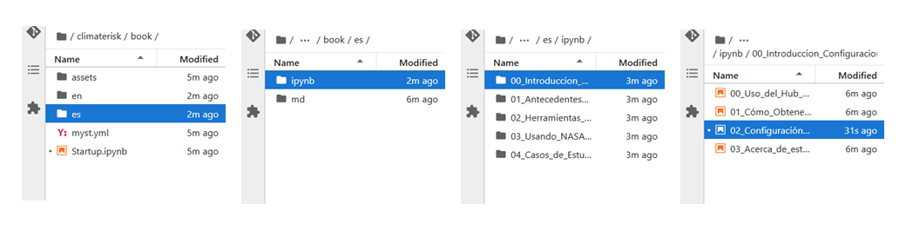
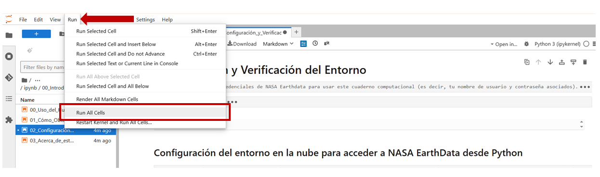

## Credenciales NASA Earthdata Cloud

Para poder participar de las actividades prácticas, vas a necesitar crear tu cuenta en el sistema de [NASA Earthdata](https://urs.earthdata.nasa.gov/). Podés seguir este tutorial paso a paso para hacerlo: [http://tiny.cc/credenciales_NASA](http://tiny.cc/credenciales_NASA).

Recordá guardar tus **credenciales (usuario y contraseña) y tenerlas a mano durante el taller**, ya que las vas a necesitar para acceder a los datos desde la nube.

-------------

## Para realizar el taller utilizando el Hub de 2i2c

El hub de 2i2c es una plataforma basada en [JupyterHub](https://jupyter.org/hub), diseñada para ofrecer entornos de computación reproducibles en la nube. Permite a personas usuarias trabajar con herramientas como Jupyter Notebooks, RStudio o VS Code, sin necesidad de instalar software localmente.

Cada hub es personalizado para una comunidad específica, con acceso controlado y preconfigurado con los paquetes, librerías y datos necesarios para trabajar.

Este entorno facilita la enseñanza y el aprendizaje de ciencia de datos, programación y teledetección sin barreras técnicas, promoviendo prácticas reproducibles y abiertas.

Aquí encontrarás las instrucciones para iniciar sesión en la nube con la plataforma proporcionada por 2i2c para este tutorial.

**Importante:** No podrás completar este paso hasta el día que inicie el tutorial (ese día recibirás la contraseña).


### Iniciar sesión en el hub


Para iniciar sesión en el JupyterHub proporcionado por 2i2c:

1. Navega hasta el Hub de 2i2c: Tu navegador web debe apuntar a [este enlace](https://climaterisk.opensci.2i2c.cloud).
2. Inicia sesión con tus credenciales:
    - **Nombre de usuario:** Puedes elegir cualquier nombre de usuario que desees. Sugerimos que utilices tu nombre de usuario de GitHub para evitar conflictos.
    - **Contraseña:** Recibirás la contraseña el día que inicie el tutorial.


::: callout

El proceso de inicio de sesión puede tardar unos minutos, especialmente si es necesario crear un nuevo espacio de trabajo virtual solo para ti.

:::

Al iniciar sesión en https://climaterisk.opensci.2i2c.cloud se clonará automáticamente un repositorio para trabajar. Si el inicio de sesión es exitoso, verás la siguiente pantalla y estarás listo para empezar a trabajar.


3. Vincula tu usuario de hub con tus credenciales de NASA Earthdata. Para eso debes acceder a la notebook 02_Configuración_y_Verificacion_del_Entorno y ejecutar todas las celdas. 

- `book/`
  - `es/`
    - `ipynb/`
      - `00_Introduccion_Configuracion/`
        - `02_Configuración_y_Verificación_del_Entorno.md`
        






4. Te preguntará si quieres proceder a sobrescribir el archivo .netrc. Confirma que sí ingresando `S` y presionando `enter`.


5. Ingresa tus credenciales de NASA Earthdata (usuario y contraseña). Si todo funcionó correctamente, se te indicará que el archivo .netrc con tus credenciales se configuró correctamente. 

6. Finalmente, ingresa a la notebook sobre la que estaremos trabajando:


- `book/`
  - `es/`
    - `ipynb/`
      - `05_Casos_de_Estudio/`
        - `05_Deforestacion_en_Maranhão.md`
        


## Para realizar el taller trabajando de forma local

### Prerrequisitos

Antes de comenzar, asegurate de cumplir con lo siguiente:

- Una computadora personal con conexión a internet
  - Sistema operativo: Windows 10/11, MacOS o Linux.
  - Al menos 6 GB de espacio libre en disco (para instalar Anaconda y el
repositorio).

- Acceso a Git
  - Git es la herramienta que permite descargar repositorios desde GitHub.
  - Si no lo tenés, puedes descargarlo desde 👉 https://git-scm.com/downloads.

- Cuenta en GitHub (opcional pero recomendado)
  -  No es requisito para descargar el material del curso, pero sí es necesaria si
quieres “forkear” o contribuir al repositorio. Puedes encontrar algunos
tutoriales sobre cómo contribuir a un repositorio en GitHub [aquí](https://youtu.be/Rh7f4Jdnoe8?si=uel4c4SkXZSOvjNK).

### Instalar Anaconda

🐍 **¿Qué es Anaconda?**

Anaconda es un programa que funciona como “caja de herramientas” para trabajar con
Python y ciencia de datos.

- Incluye Python (el lenguaje que usamos en el curso).
- Trae instaladas muchas librerías científicas que facilitan funciones adicionales (útiles
para, por ejemplo, manejar datos, hacer gráficos, trabajar con la nube).
- Permite crear entornos aislados para cada proyecto, que pueden tener sus propias
librerías y versiones, sin chocar con otros proyectos en tu computadora.
- Viene con JupyterLab, que es la aplicación que usamos para abrir y ejecutar
notebooks (archivos con extensión .ipynb).

En otras palabras, Anaconda te da todo lo que necesitas para ejecutar notebooks como las
que se utilizan durante el curso en el hub de 2i2c, pero ahora en tu propia computadora.

**Pasos a seguir**

1. Ingresa a la página de descarga: https://www.anaconda.com/download

2. En la página de Anaconda vas a ver dos opciones principales:
  - Anaconda Distribution (Distribution Installers): Es la versión completa. Trae Python + Conda (un gestor de paquetes de software) + muchas
librerías de ciencia de datos + Jupyter + Spyder + herramientas gráficas. Pesa bastante pero evita pasos extra.
  - Miniconda (Miniconda Installers): Es la versión mínima. Solo trae Python + Conda, el resto (Jupyter, librerías, etc.) tienes que instalarlas manualmente o a
través de la configuración de los archivos environment.yml. Pesa muy poco y es más flexible para usuarios avanzados.

👉 Para este curso, si todavía no lo tienes instalado, lo más sencillo es que instales **Anaconda Distribution (Distribution Installers)**.

3. Selecciona el instalador según tu sistema operativo.

4. Descarga la versión recomendada. Para algunos sistemas operativos se muestran distintas versiones:
  - 64-Bit (Graphical Installer): es la más fácil, porque abre un instalador con ventanas gráficas (opción recomendada).
  - 64-Bit (Command Line Installer): es solo para gente que prefiere instalar desde la terminal.

5. Instala Anaconda. Por ejemplo, si usas Windows:
  - Abre el archivo (.exe) descargado.
  - Sigue los pasos del instalador (puedes dejar las opciones por defecto).

Con esto, ya tienes Anaconda listo para crear el entorno y abrir la notebook del
repositorio.

### Clonar el repositorio climaterisk

1. Abre la terminal o línea de comandos.

Dependiendo de tu sistema operativo:

  - Windows: busca y abre el programa Anaconda Prompt (viene instalado con Anaconda).
  - Mac: abre la aplicación Terminal (la encontrarás en Aplicaciones > Utilidades).
  - Linux: abre la aplicación Terminal desde el menú.

2. Clona el repositorio climaterisk:

  - Navega a la carpeta en la que quieres descargarlo (asegúrate de tener permisos de escritura en esa carpeta).
  - En la terminal, escribe:
  
```bash

git clone https://github.com/ScienceCore/climaterisk.git

```

### Crear el entorno de trabajo con conda

1. Navega a la carpeta climaterisk escribiendo:

```bash
cd climaterisk

```

2. Dentro de la carpeta climaterisk, escribe:

```bash
conda env create -f environment.yml -n climaterisk

```

Esto va a:
  - Leer el archivo environment.yml que está en el repositorio.
  - Instalar todas las librerías necesarias según se especifica en ese archivo.
  - Crear un entorno llamado: climaterisk.

::: callout

👉 El proceso utiliza mucha memoria RAM y podría tardar varios minutos. Para
facilitar el proceso, intenta no tener muchas pestañas del navegador abiertas
y cierra las aplicaciones pesadas que estés usando.

:::


3. Una vez que termine, activa el entorno escribiendo:

```bash
conda activate climaterisk

```

Vas a notar que el nombre (climaterisk) aparece al principio de la línea en tu
terminal: eso indica que ya estás dentro del entorno.

### Abrir JupyterLab

Por último, escribí:

```bash

jupyter lab

```

Esto abrirá tu navegador web y mostrará la interfaz de JupyterLab, donde verás la carpeta
del repositorio.

Allí debes navegar hasta la notebook `startup.ipynb` utilizando la vista de archivos que se
encuentra a la izquierda para ingresar a la carpeta `book/`.


### Vincular tus credenciales de NASA Earthdata

1. Debes acceder a la notebook `02_Configuración_y_Verificacion_del_Entorno` y ejecutar todas las celdas. 

- `book/`
  - `es/`
    - `ipynb/`
      - `00_Introduccion_Configuracion/`
        - `02_Configuración_y_Verificación_del_Entorno.md`
        


2. Te preguntará si quieres proceder a sobrescribir el archivo .netrc. Confirma que sí ingresando `S` y presionando `enter`.


3. Ingresa tus credenciales de NASA Earthdata (usuario y contraseña). Si todo funcionó correctamente, se te indicará que el archivo .netrc con tus credenciales se configuró correctamente. 

4. Finalmente, ingresa a la notebook sobre la que estaremos trabajando:


- `book/`
  - `es/`
    - `ipynb/`
      - `05_Casos_de_Estudio/`
        - `05_Deforestacion_en_Maranhão.md`
        


